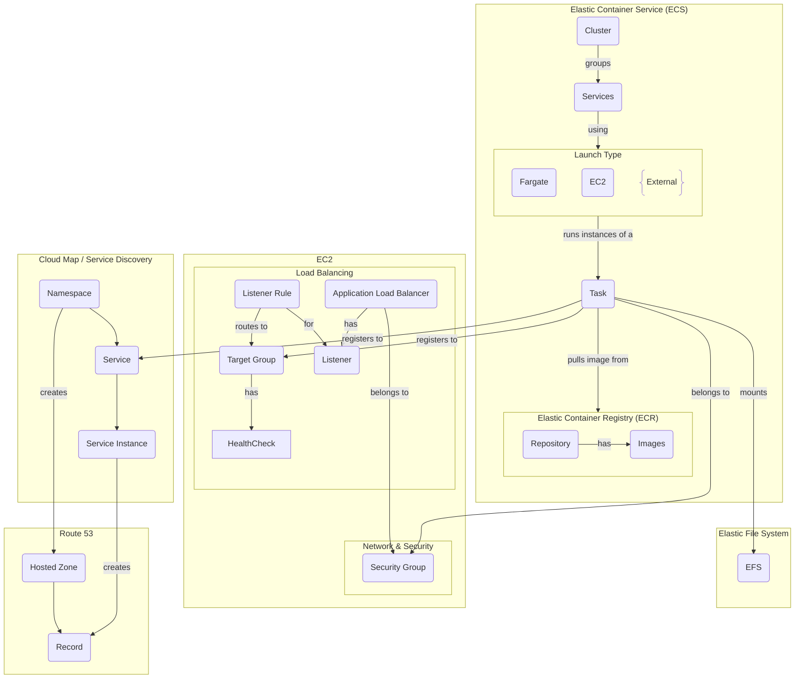

### ECS - EC2 - Cloud Map

```mermaid
flowchart TB
    subgraph ECS["Elastic Container Service (ECS)"]
        Service(Services)
        Cluster(Cluster)
        Task(Task)
        subgraph ECR["Elastic Container Registry (ECR)"]
            Repository(Repository)
            Image(Images)
            Repository -- has --> Image
        end
        subgraph LaunchType[Launch Type]
            direction TB
            Fargate(Fargate)
            EC2a(EC2)
            External(External)@{ shape: braces }
        end

        Cluster --> |groups| Service
        Task ---> |pulls image from|ECR
        Service --using--> LaunchType
        LaunchType -->|runs instances of a| Task
    end

    subgraph Storage["Elastic File System"]
        EFS(EFS)
    end

    subgraph EC2["EC2"]
        subgraph LoadBalancing["Load Balancing"]
            ALB(Application Load Balancer)
            TG(Target Group)
            L(Listener)
            LR(Listener Rule)

            LR -- for --> L
            ALB -- has --> L
            LR -- routes to --> TG
            TG -- has --> HealthCheck
        end
        subgraph Network["Network & Security"]
            SG(Security Group)
            %%SG -- has --> Inbound
            %%SG -- has --> Outbound
        end
        ALB ----> |belongs to| SG
    end

    subgraph CloudMap["Cloud Map / Service Discovery"]
        CMN(Namespace)
        CMS(Service)
        CMI(Service Instance)
        CMN --> CMS
        CMS --> CMI
    end

    subgraph Route53["Route 53"]
        HostedZone(Hosted Zone)
        Record(Record)
        HostedZone --> Record
    end

    %% Cross-subgraph connections
    Task ----> |mounts| EFS
    Task --> |registers to| TG
    Task --> |belongs to| SG
    Task --> |registers to| CMS

    CMN ---> |creates| HostedZone
    CMI ---> |creates| Record
```
